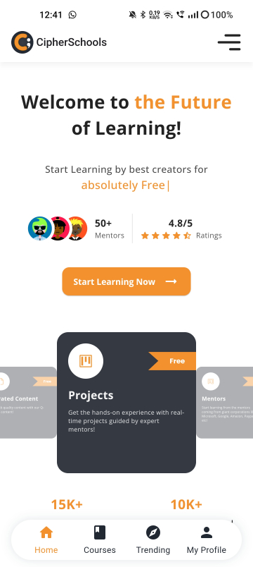
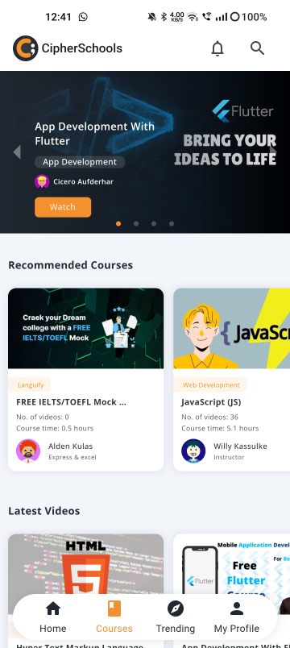
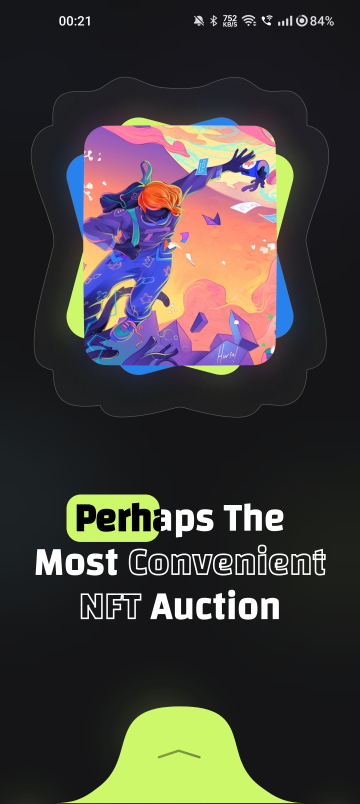
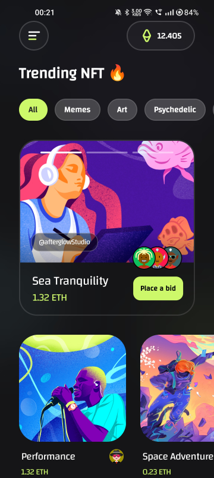

# Flutter Challenges

This is a personal Github repository for weekly challenges using the Flutter framework. Each week, I will challenge myself to either create a new UI design or a functionality using Flutter.

## Weekly Challenges
| Week | Challenge | Type |
| :---: | --- | :---: |
| 01 | [CipherSchools Website Recreation](https://github.com/rondey84/flutter-challenges#week-01---cipherschools-website-recreation) | UI |
| 02 | [DeepKlarity Assignment](https://github.com/rondey84/flutter-challenges#week-02---deepklarity-assignment) | Functionality |
| 03 | [Artello](https://github.com/rondey84/flutter-challenges#week-03---artello) | UI |

### Week 01 - CipherSchools Website Recreation
[Go To Project](https://github.com/rondey84/flutter-challenges/tree/main/week_01_cipherschools_recreate)

 

Preview

 

### Week 02 - DeepKlarity Assignment
[Go To Project](https://github.com/rondey84/flutter-challenges/tree/main/week_02_deepklarity_assignment)

Preview

https://github.com/rondey84/flutter-challenges/assets/22190833/850baba2-62c0-48e8-bd9d-e7b842a34655

### Week 03 - Artello
[Go To Project](https://github.com/rondey84/flutter-challenges/tree/main/week_03_artello)

Preview

 

