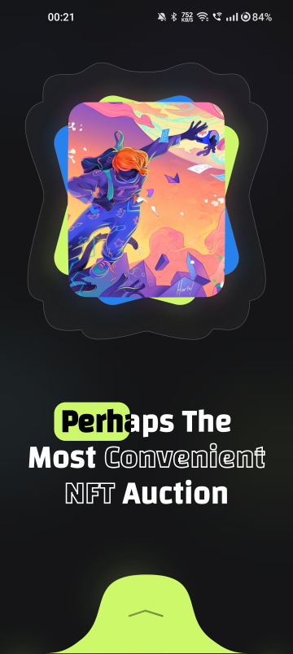
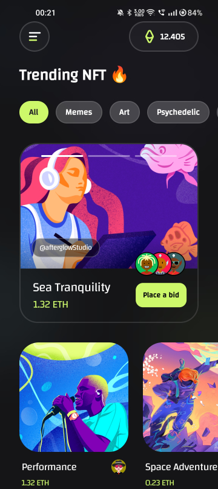

# Flutter Challenges

This is a personal Github repository for weekly challenges using the Flutter framework. Each week, I will challenge myself to either create a new UI design or a functionality using Flutter.

## Gettting Started

To run the project, ensure that you have Flutter and Dart installed on your system. This project is already set up to use Flutter Version Manager (FVM).

#### Step 1 - Flutter Version

The current version of flutter being used for the projects is: `3.13.8`. Ensure that you have version 3.10.1 or higher.

#### Step 2 - Installing Packages

Install packages required to run the project, execute the following command:

```
flutter pub get
```

If using FVM:

```
fvm flutter pub get
```

#### Step 3 - Build Runner

Some of the projects depends on `build_runner`.

```
dart run build_runner build
```

#### Step 4 - Native Splash

Some of the projects have their own splash screens. To build their respective splash screens use the following command:

```
dart run flutter_native_splash:create --path=native_splash/week_<week_numer>.yaml
```

Projects that currently have their own native splash

```
1) Week 03 - Artello
dart run flutter_native_splash:create --path=native_splash/week_03.yaml
```

#### Step 5 - Running the project

To run a project you can use the following terminal command:

```
flutter run -t lib/week_<week_number>/main.dart
```

Where ***week_number*** is the respective weekly challenge number given in the table below.

For Example to run CipherSchools Website Recreation Project we will use:

```
flutter run -t lib/week_01/main.dart
```

Alternatively, you can run the project via vs-code's run helper for each project's using their respective main.dart files.

## Weekly Challenges

| Week | Challenge                                                                                                                  |     Type     |
| :--: | -------------------------------------------------------------------------------------------------------------------------- | :-----------: |
|  01  | [CipherSchools Website Recreation](https://github.com/rondey84/flutter-challenges#week-01---cipherschools-website-recreation) |      UI      |
|  02  | [DeepKlarity Assignment](https://github.com/rondey84/flutter-challenges#week-02---deepklarity-assignment)                     | Functionality |
|  03  | [Artello](https://github.com/rondey84/flutter-challenges#week-03---artello)                                                   |      UI      |

### Week 01 - CipherSchools Website Recreation

[Go To Project](https://github.com/rondey84/flutter-challenges/tree/main/lib/week_01)

<details> 
<summary>Preview</summary>

 

</details>

### Week 02 - DeepKlarity Assignment

[Go To Project](https://github.com/rondey84/flutter-challenges/tree/main/lib/week_02)

<details>
<summary>Preview</summary>

https://github.com/rondey84/flutter-challenges/assets/22190833/850baba2-62c0-48e8-bd9d-e7b842a34655

</details>

### Week 03 - Artello

[Go To Project](https://github.com/rondey84/flutter-challenges/tree/main/lib/week_03)

<details>
<summary>Preview</summary>

 

</details>
