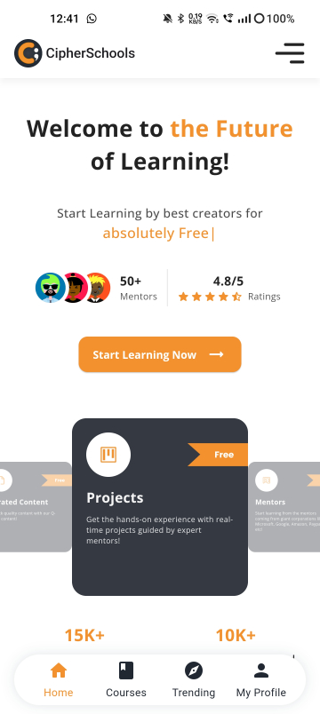
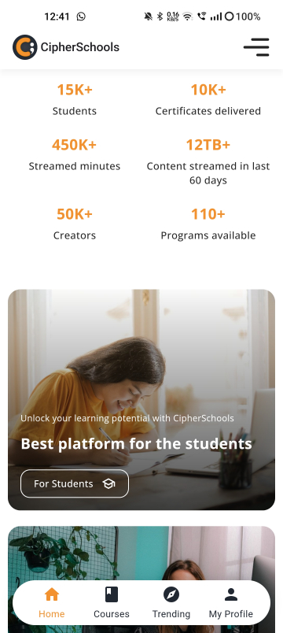
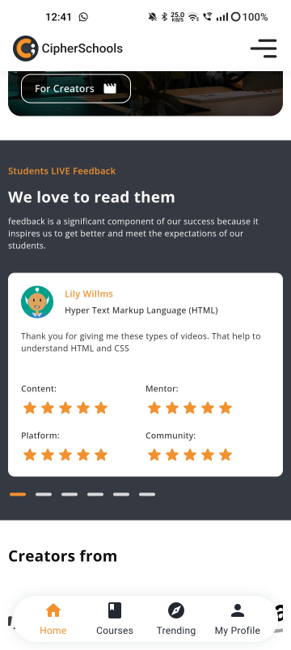
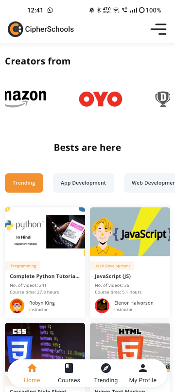
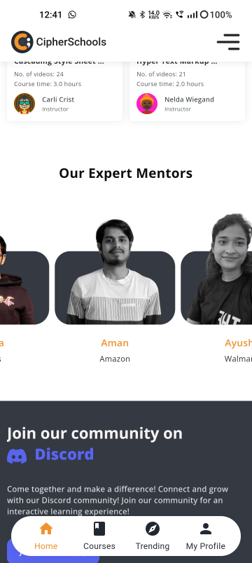
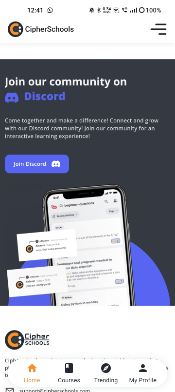
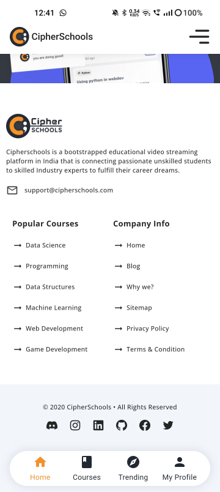
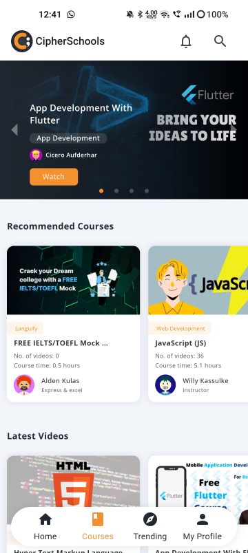
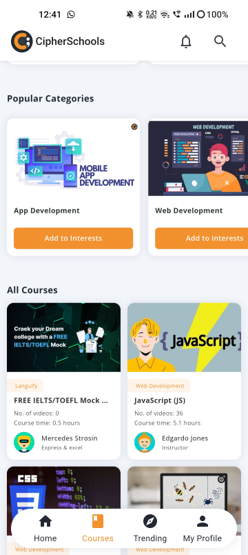
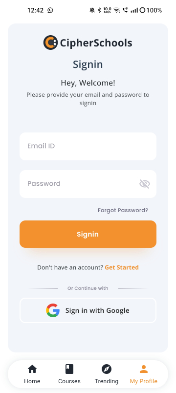

# Week 01 - Cipherschools Website Recreate

Welcome to the CipherSchools website recreation project. The purpose of this project is to replicate the visual design of the [CipherSchools website](https://www.cipherschools.com/ "CipherSchools Website") using Flutter and Dart for a mobile device.

## Project Type

This is a **UI Challenge** project.

## ScreenShots and Recordings

https://user-images.githubusercontent.com/22190833/236405747-3e2840ac-0461-46cb-9436-a07a758102a5.mp4

      

 

## Project Overview

The project has been built using Flutter SDK v3.7.12 and Dart SDK v2.19.6. Flutter is an open-source mobile application development framework created by Google, which allows for fast and efficient development of high-quality apps for multiple platforms, including iOS, Android, web, and desktop.

## Project Goals

The primary goal of this project is to recreate the visual design of the CipherSchools website using Flutter widgets and custom styles. The project will involve replicating the website's layout, color scheme, typography, images, and other visual elements.

## Why this Project?

I took up this project as a challenge to improve my Flutter development skills and to gain experience in replicating complex website designs using Flutter. Moreover, this project was initially offered to me as a task during my internship application at CipherSchools during Covid-19.

## Conclusion

This project is an excellent opportunity for anyone who wants to gain experience in replicating complex website designs using Flutter and Dart. It will help you improve your Flutter development skills, and the end result will be a stunning recreation of the CipherSchools website.
